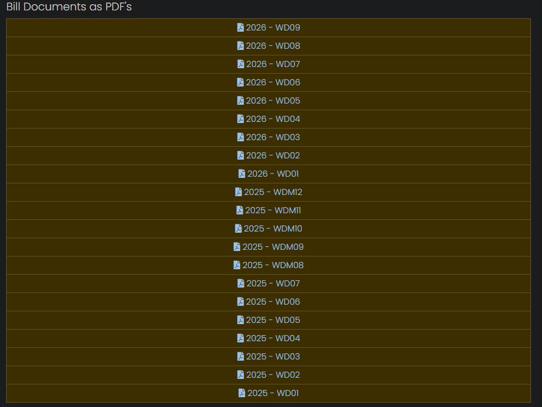
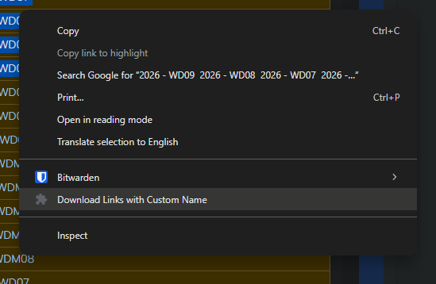
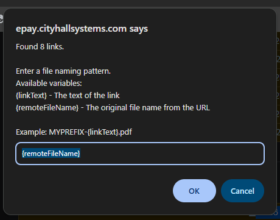

# Download Selected Links - Chrome Extension

A lightweight, customizable Chrome extension that allows you to highlight text on any webpage, extract all underlying hyperlinks, and download the associated files in bulk using a custom file naming structure.

## 🚀 Features

* **Context Menu Integration:** Accessible directly from your right-click menu whenever text is highlighted.
* **Smart Extraction:** Scans the highlighted HTML DOM to grab hidden `href` attributes, ignoring plain text and dead links.
* **Custom File Naming:** Prompts you to define how the downloaded files should be named using dynamic variables.
* **Auto-Sanitization:** Automatically strips illegal characters from file names to prevent OS-level download failures.
* **Conflict Resolution:** Safely appends numbers (e.g., `file (1).pdf`) if a file with the same name already exists in your downloads folder.

## 📁 File Structure

This extension requires only two files to run:
* `manifest.json` - Defines the extension's metadata, permissions, and background scripts.
* `background.js` - Handles the context menu creation, script injection, user prompting, and download execution.

## 🛠️ Installation (Developer Mode)

Since this is an unpacked extension, you will need to load it manually into Chrome:

1. Clone or download this repository to your local machine. Ensure both `manifest.json` and `background.js` are in the same folder.
2. Open Google Chrome and navigate to `chrome://extensions/` in the address bar.
3. Toggle the **Developer mode** switch in the top-right corner to **ON**.
4. Click the **Load unpacked** button in the top-left corner.
5. Select the folder containing your extension files.
6. The extension should now appear in your list of installed extensions.

## � Build / Bundle for Chrome Web Store

1. Install Node dependencies:
   ```bash
   npm install
   ```
2. Create the published extension bundle:
   ```bash
   npm run bundle
   ```
3. Upload the generated `select-downloader.zip` file to the Chrome Web Store developer dashboard.

> The bundler excludes development files like `package.json`, `package-lock.json`, and the `scripts/` folder.

## �📖 Usage Guide

1. Navigate to any webpage containing links you want to download.
2. Click and drag your mouse to **highlight the text** containing the links.
3. **Right-click** on the highlighted text.
4. Select **"Download Links with Custom Name"** from the context menu.
5. A prompt will appear telling you how many links were found. Enter your preferred naming pattern (see below) and click **OK**.
6. The files will automatically begin downloading to your default Chrome downloads folder.

### 🏷️ File Naming Variables

When prompted, you can use the following variables to dynamically name your downloaded files:

* `{linkText}` - The visible, clicked text of the link on the webpage (spaces are automatically converted to underscores).
* `{remoteFileName}` - The original file name extracted from the end of the URL.

**Examples:**
* Pattern: `{remoteFileName}`
  * *Result:* `original_document.pdf`
* Pattern: `INVOICE-{linkText}.pdf`
  * *Result:* `INVOICE-January_Billing.pdf`
* Pattern: `PROJECT_X-{remoteFileName}`
  * *Result:* `PROJECT_X-asset_v2.png`

## ⚠️ Important Notes

* **Extensions:** If you use `{linkText}` as the core of your file name, ensure you manually type the file extension into the prompt (e.g., `.pdf`, `.jpg`). If you use `{remoteFileName}`, the original extension is usually preserved automatically.
* **Permissions:** This extension requires `downloads`, `activeTab`, `scripting`, and `contextMenus` permissions to function. It only interacts with the webpage when you explicitly use the right-click menu.

## Example Use case
For downloading all your selected PDF documents on a page using custom file naming convention.

Like downloading utility PDFs from https://epay.cityhallsystems.com/history/printed.

Find the list of links


Right click on the selection


File naming
